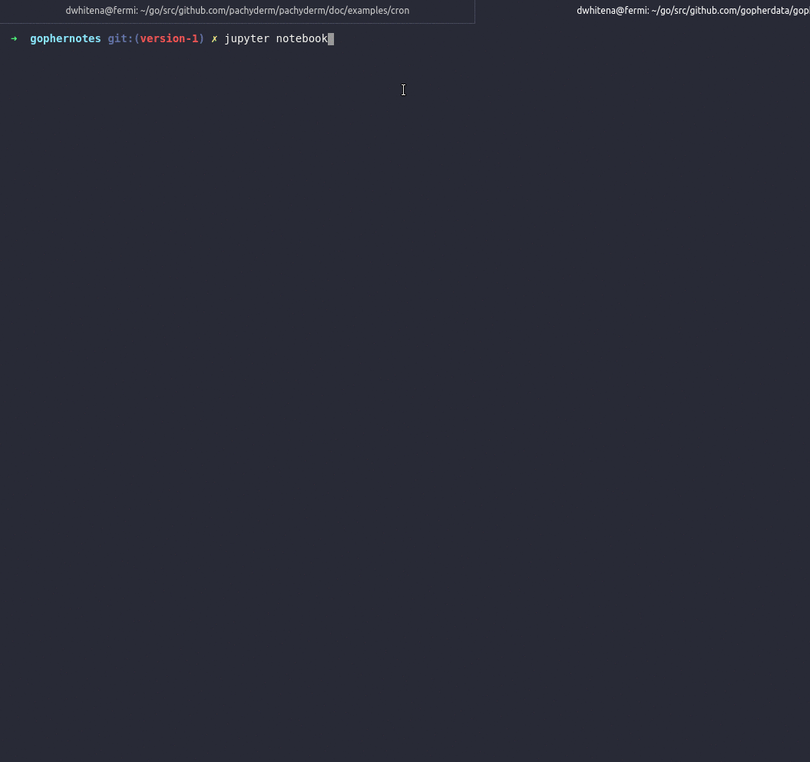
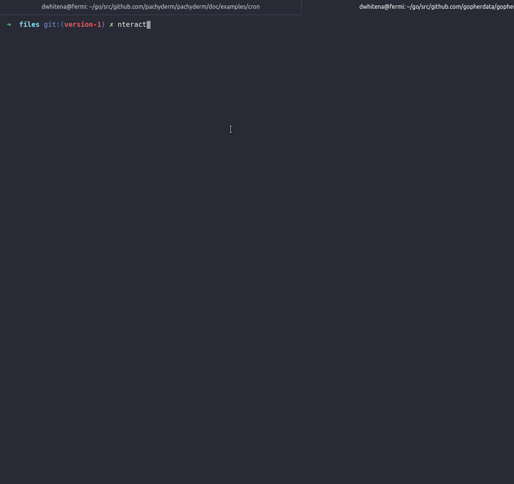

[](https://travis-ci.org/gopherdata/gophernotes)
[](https://github.com/gopherdata/gophernotes/blob/master/LICENSE)

# gophernotes - Use Go in Jupyter notebooks and nteract

`gophernotes` is a Go kernel for [Jupyter](http://jupyter.org/) notebooks and [nteract](https://nteract.io/).  It lets you use Go interactively in a browser-based notebook or desktop app.  Use `gophernotes` to create and share documents that contain live Go code, equations, visualizations and explanatory text.  These notebooks, with the live Go code, can then be shared with others via email, Dropbox, GitHub and the [Jupyter Notebook Viewer](http://nbviewer.jupyter.org/). Go forth and do data science, or anything else interesting, with Go notebooks!

**Acknowledgements** - This project utilizes a Go interpreter called [gomacro](https://github.com/cosmos72/gomacro) under the hood to evaluate Go code interactively. The gophernotes logo was designed by the brilliant [Marcus Olsson](https://github.com/marcusolsson) and was inspired by Renee French's original Go Gopher design.

- [Examples](#examples)
- Install gophernotes:
  - [Prerequisites](#prerequisites)
  - [Linux](#linux)
  - [Mac](#mac)
  - [Windows](#windows)
  - [Docker](#docker)
- [Getting Started](#getting-started)
- [Limitations](#limitations)
- [Troubleshooting](#troubleshooting)

## Examples

### Jupyter Notebook:



### nteract:



### Example Notebooks (download and run them locally, follow the links to view in Github, or use the [Jupyter Notebook Viewer](http://nbviewer.jupyter.org/)):
- [Worker Pools](examples/Worker_Pools.ipynb)
- [Matrix Operations](examples/Matrix_Operations.ipynb)
- [Facial Recognition](examples/Facial_Recognition_MachineBox.ipynb)
- [Display Images, HTML, LaTeX...](examples/Display.ipynb)

## Installation

### Prerequisites

- [Go 1.11+](https://golang.org/doc/install) - including GOPATH/bin added to your PATH (i.e., you can run Go binaries that you `go install`).
- [Jupyter Notebook](http://jupyter.readthedocs.io/en/latest/install.html) or [nteract](https://nteract.io/desktop)
- [git](https://git-scm.com/download) - usually already present on Linux and Mac OS X. If not present, follow the instructions at [https://git-scm.com/download](https://git-scm.com/download)

### Linux

Quick installation as module, requires Go 1.12+
```sh
$ env GO111MODULE=on go get github.com/gopherdata/gophernotes
$ mkdir -p ~/.local/share/jupyter/kernels/gophernotes
$ cd ~/.local/share/jupyter/kernels/gophernotes
$ cp "$(go env GOPATH)"/pkg/mod/github.com/gopherdata/gophernotes@v0.7.0/kernel/*  "."
$ chmod +w ./kernel.json # in case copied kernel.json has no write permission
$ sed "s|gophernotes|$(go env GOPATH)/bin/gophernotes|" < kernel.json.in > kernel.json
```

Manual installation from GOPATH, also works with Go 1.11
```sh
$ env GO111MODULE=off go get -d -u github.com/gopherdata/gophernotes
$ cd "$(go env GOPATH)"/src/github.com/gopherdata/gophernotes
$ env GO111MODULE=on go install
$ mkdir -p ~/.local/share/jupyter/kernels/gophernotes
$ cp kernel/* ~/.local/share/jupyter/kernels/gophernotes
$ cd ~/.local/share/jupyter/kernels/gophernotes
$ chmod +w ./kernel.json # in case copied kernel.json has no write permission
$ sed "s|gophernotes|$(go env GOPATH)/bin/gophernotes|" < kernel.json.in > kernel.json
```

To confirm that the `gophernotes` binary is installed in GOPATH, execute it directly:
```sh
$ "$(go env GOPATH)"/bin/gophernotes
```
and you shoud see the following:
```sh
2017/09/20 10:33:12 Need a command line argument specifying the connection file.
```

**Note** - if you have the `JUPYTER_PATH` environmental variable set or if you are using an older version of Jupyter, you may need to copy this kernel config to another directory.  You can check which directories will be searched by executing:

```sh
$ jupyter --data-dir
```

### Mac

**Important Note** - gomacro relies on the `plugin` package when importing third party libraries. This package works reliably on Mac OS X with Go 1.10.2+ as long as you **never** execute the command `strip gophernotes`.

Quick installation as module, requires Go 1.12+
```sh
$ env GO111MODULE=on go get github.com/gopherdata/gophernotes
$ mkdir -p ~/Library/Jupyter/kernels/gophernotes
$ cd ~/Library/Jupyter/kernels/gophernotes
$ cp "$(go env GOPATH)"/pkg/mod/github.com/gopherdata/gophernotes@v0.7.0/kernel/*  "."
$ chmod +w ./kernel.json # in case copied kernel.json has no write permission
$ sed "s|gophernotes|$(go env GOPATH)/bin/gophernotes|" < kernel.json.in > kernel.json
```

Manual installation from GOPATH, also works with Go 1.11
```sh
$ env GO111MODULE=off go get -d -u github.com/gopherdata/gophernotes
$ cd "$(go env GOPATH)"/src/github.com/gopherdata/gophernotes
$ env GO111MODULE=on go install
$ mkdir -p ~/Library/Jupyter/kernels/gophernotes
$ cp kernel/* ~/Library/Jupyter/kernels/gophernotes
$ cd ~/Library/Jupyter/kernels/gophernotes
$ chmod +w ./kernel.json # in case copied kernel.json has no write permission
$ sed "s|gophernotes|$(go env GOPATH)/bin/gophernotes|" < kernel.json.in > kernel.json
```

To confirm that the `gophernotes` binary is installed in GOPATH, execute it directly:
```sh
$ "$(go env GOPATH)"/bin/gophernotes
```
and you shoud see the following:
```sh
2017/09/20 10:33:12 Need a command line argument specifying the connection file.
```

**Note** - if you have the `JUPYTER_PATH` environmental variable set or if you are using an older version of Jupyter, you may need to copy this kernel config to another directory.  You can check which directories will be searched by executing:

```sh
$ jupyter --data-dir
```

### Windows

**Important Note** - gomacro relies on the `plugin` package when importing third party libraries.  This package is only supported on Linux and Mac OS X currently.  Thus, if you need to utilize third party packages in your Go notebooks and you are running on Windows, you should use the [Docker](#docker) install and run gophernotes/Jupyter in Docker.

1. Copy the kernel config:

    ```
    mkdir %APPDATA%\jupyter\kernels\gophernotes
    xcopy %GOPATH%\src\github.com\gopherdata\gophernotes\kernel %APPDATA%\jupyter\kernels\gophernotes /s
    ```

    Note, if you have the `JUPYTER_PATH` environmental variable set or if you are using an older version of Jupyter, you may need to copy this kernel config to another directory.  You can check which directories will be searched by executing:

    ```
    jupyter --data-dir
    ```

2. Update `%APPDATA%\jupyter\kernels\gophernotes\kernel.json` with the FULL PATH to your gophernotes.exe (in %GOPATH%\bin), unless it's already on the PATH.  For example:

    ```
    {
        "argv": [
          "C:\\gopath\\bin\\gophernotes.exe",
          "{connection_file}"
          ],
        "display_name": "Go",
        "language": "go",
        "name": "go"
    }
    ```

### Docker

You can try out or run Jupyter + gophernotes without installing anything using Docker. To run a Go notebook that only needs things from the standard library, run:

```
$ docker run -it -p 8888:8888 gopherdata/gophernotes
```

Or to run a Go notebook with access to common Go data science packages (gonum, gota, golearn, etc.), run:

```
$ docker run -it -p 8888:8888 gopherdata/gophernotes:latest-ds
```

In either case, running this command should output a link that you can follow to access Jupyter in a browser. Also, to save notebooks to and/or load notebooks from a location outside of the Docker image, you should utilize a volume mount.  For example:

```
$ docker run -it -p 8888:8888 -v /path/to/local/notebooks:/path/to/notebooks/in/docker gopherdata/gophernotes
```

## Getting Started

### Jupyter

- If you completed one of the local installs above (i.e., not the Docker install), start the jupyter notebook server:

  ```
  jupyter notebook
  ```

- Select `Go` from the `New` drop down menu.

- Have fun!

### nteract

- Launch nteract.

- From the nteract menu select Language -> Go.

- Have fun!

## Limitations

gophernotes uses [gomacro](https://github.com/cosmos72/gomacro) under the hood to evaluate Go code interactively. You can evaluate most any Go code with gomacro, but there are some limitations, which are discussed in further detail [here](https://github.com/cosmos72/gomacro#current-status).  Most notably, gophernotes does NOT support:

- third party packages when running natively on Windows - This is a current limitation of the Go `plugin` package.
- some corner cases on interpreted interfaces, as interface -&gt; interface type switch and type assertion, are not implemented yet.
- some corner cases on recursive types may not work correctly.
- conversion from typed constant to interpreted interface is not implemented. Workaround: assign the constant to a variable, then convert the variable to the interpreted interface type.
- conversions from/to unsafe.Pointer are not supported.
- goto is only partially implemented.
- out-of-order code in the same cell is supported, but not heavily tested. It has some known limitations for composite literals.

## Troubleshooting

### gophernotes not found

Depending on your environment, you may need to manually change the path to the `gophernotes` executable in `kernel/kernel.json` before copying it to `~/.local/share/jupyter/kernels/gophernotes`.  You can put the **full path** to the `gophernotes` executable here, and you shouldn't have any further issues.

### "Kernel error" in a running notebook

```
Traceback (most recent call last):
  File "/usr/local/lib/python2.7/site-packages/notebook/base/handlers.py", line 458, in wrapper
    result = yield gen.maybe_future(method(self, *args, **kwargs))
  File "/usr/local/lib/python2.7/site-packages/tornado/gen.py", line 1008, in run
    value = future.result()
  ...
  File "/usr/local/Cellar/python/2.7.11/Frameworks/Python.framework/Versions/2.7/lib/python2.7/subprocess.py", line 1335, in _execute_child
    raise child_exception
OSError: [Errno 2] No such file or directory
```

Stop jupyter, if it's already running.

Add a symlink to `/go/bin/gophernotes` from your path to the gophernotes executable. If you followed the instructions above, this will be:

```
sudo ln -s $HOME/go/bin/gophernotes /go/bin/gophernotes
```

Restart jupyter, and you should now be up and running.

### error "could not import C (no metadata for C)" when importing a package

At a first analysis, it seems to be a limitation of the new import mechanism that supports Go 1.11 modules.
You can switch the old (non module-aware) mechanism with the command `%go111module off`

To re-enable modules support, execute `%go111module on`

### Look at Jupyter notebook's logs for debugging

In order to see the logs for your Jupyter notebook, use the --log-level option
```
jupyter notebook --log-level DEBUG
```
